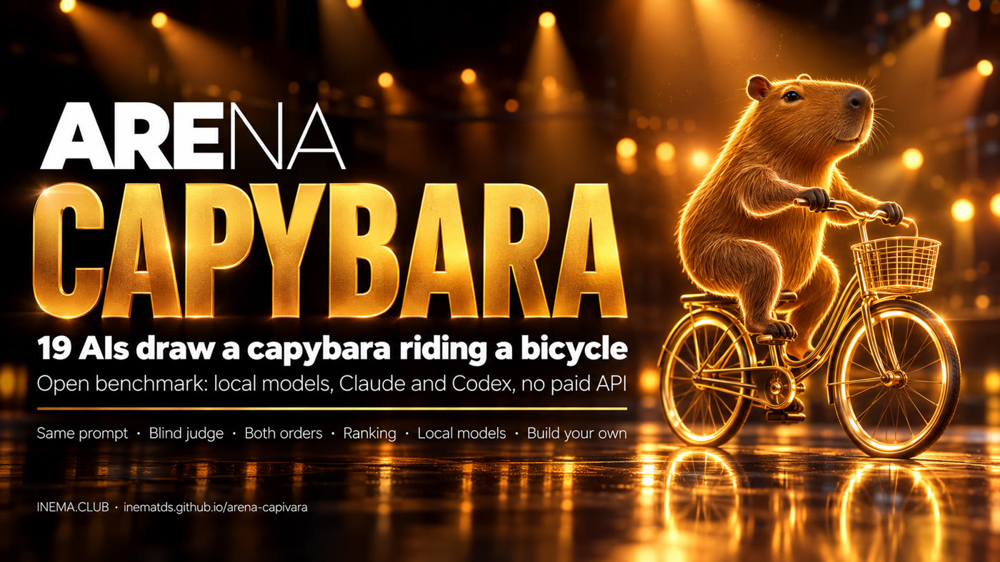

# Capybara Arena

[](https://inematds.github.io/arena-capivara/guia/en/)

**🇧🇷 [Português](README.md) · 🇺🇸 [English](README.en.md) · 🇪🇸 [Español](README.es.md)**

Which AI draws the best capybara riding a bicycle? We asked 19 models for the same SVG: 10 running on the computer itself (Ollama) and 9 through the Claude and ChatGPT subscriptions (the `claude` and `codex` CLIs). No paid API. A blind judge compared the drawings in pairs, in both orders.

Inspired by Simon Willison's pelican-riding-a-bicycle benchmark.

## 📖 Guide and results

- Guide (what it is, how to run it, how to build your own benchmark): **https://inematds.github.io/arena-capivara/guia/en/**
- Round 1 results (ranking, gallery, code of every SVG): **https://inematds.github.io/arena-capivara/resultados/en/**

## Round 1 (2026-10-05)

| # | Model | Runs on | Wins |
|---|---|---|---|
| 1 | Claude Fable 5.1 | Claude subscription | 97% |
| 2 | GPT-6.1 Sol | ChatGPT/Codex subscription | 94% |
| 3 | GPT-6 Astra | ChatGPT/Codex subscription | 91% |
| 4 | Claude Opus 5.5 | Claude subscription | 82% |
| 5 | **Qwen 3.8 27B** | **your own PC** | 74% |
| 6 | GPT-5.5 | ChatGPT/Codex subscription | 71% |
| 7 | Claude Sonnet 5.5 | Claude subscription | 65% |

Full table (18 models with a valid SVG; Command R 35B did not deliver one) on the [results page](https://inematds.github.io/arena-capivara/resultados/en/). Judge: Claude Sonnet 5.5, 306 matchups. A second judge (GPT-6 Luna) agreed on 92% of the 64 it redid. The left side won 49.7% (no position bias). One attempt per model: a snapshot, not a verdict. The prompt and the judge question are in Portuguese.

## Run it on your PC

```bash
pip install cairosvg pillow
git clone https://github.com/inematds/arena-capivara && cd arena-capivara
# edit arena/modelos.json with the models you have
python3 arena/gerar.py           # asks each model for the drawing
python3 arena/renderizar.py      # SVG -> PNG + A|B matchups
python3 arena/julgar.py          # blind judge (Claude Sonnet 5.5 via subscription)
python3 arena/julgar.py --juiz codex --modelo gpt-6-luna --amostra 60   # second judge
python3 arena/ranking.py --tabela
python3 arena/galeria.py         # resultados/index.html (+ en/ es/)
```

The matchup images (`resultados/pares/`) are not in the repository; `renderizar.py` recreates them.

Sister project from the same talk: [Lethal Trifecta](https://inematds.github.io/triade-letal/guia/en/), when an AI agent can leak your data.

MIT license · [INEMA.CLUB](https://inema.club)
