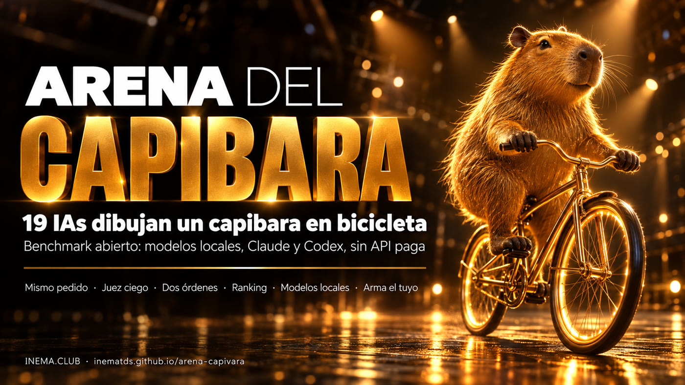

# Arena del Capibara

[](https://inematds.github.io/arena-capivara/guia/es/)

**🇧🇷 [Português](README.md) · 🇺🇸 [English](README.en.md) · 🇪🇸 [Español](README.es.md)**

¿Qué IA dibuja el mejor capibara en bicicleta? Le pedimos el mismo SVG a 19 modelos: 10 corriendo en la propia computadora (Ollama) y 9 por la suscripción de Claude y ChatGPT (las CLIs `claude` y `codex`). Ninguna API paga. Un juez ciego comparó los dibujos de dos en dos, en los dos órdenes.

Inspirado en el benchmark del pelícano en bicicleta de Simon Willison.

## 📖 Guía y resultados

- Guía (qué es, cómo correrlo, cómo armar tu propio benchmark): **https://inematds.github.io/arena-capivara/guia/es/**
- Resultados de la ronda 1 (ranking, galería, código de cada SVG): **https://inematds.github.io/arena-capivara/resultados/es/**

## Ronda 1 (05/10/2026)

| # | Modelo | Dónde corre | Victorias |
|---|---|---|---|
| 1 | Claude Fable 5.1 | suscripción Claude | 97% |
| 2 | GPT-6.1 Sol | suscripción ChatGPT/Codex | 94% |
| 3 | GPT-6 Astra | suscripción ChatGPT/Codex | 91% |
| 4 | Claude Opus 5.5 | suscripción Claude | 82% |
| 5 | **Qwen 3.8 27B** | **en tu PC** | 74% |
| 6 | GPT-5.5 | suscripción ChatGPT/Codex | 71% |
| 7 | Claude Sonnet 5.5 | suscripción Claude | 65% |

Tabla completa (18 modelos con SVG válido; Command R 35B no entregó) en la [página de resultados](https://inematds.github.io/arena-capivara/resultados/es/). Juez: Claude Sonnet 5.5, 306 enfrentamientos. Un segundo juez (GPT-6 Luna) coincidió en el 92% de los 64 que rehízo. El lado izquierdo ganó el 49,7% (sin sesgo de posición). Un intento por modelo: es una foto, no una sentencia. El pedido y la pregunta del juez están en portugués.

## Correrlo en tu PC

```bash
pip install cairosvg pillow
git clone https://github.com/inematds/arena-capivara && cd arena-capivara
# edita arena/modelos.json con los modelos que tienes
python3 arena/gerar.py           # pide el dibujo a cada modelo
python3 arena/renderizar.py      # SVG -> PNG + enfrentamientos A|B
python3 arena/julgar.py          # juez ciego (Claude Sonnet 5.5 por la suscripción)
python3 arena/julgar.py --juiz codex --modelo gpt-6-luna --amostra 60   # segundo juez
python3 arena/ranking.py --tabela
python3 arena/galeria.py         # resultados/index.html (+ en/ es/)
```

Las imágenes de los enfrentamientos (`resultados/pares/`) no están en el repositorio; `renderizar.py` las recrea.

Proyecto hermano, de la misma charla: [Tríada Letal](https://inematds.github.io/triade-letal/guia/es/), cuando un agente de IA puede filtrar tus datos.

Licencia MIT · [INEMA.CLUB](https://inema.club)
